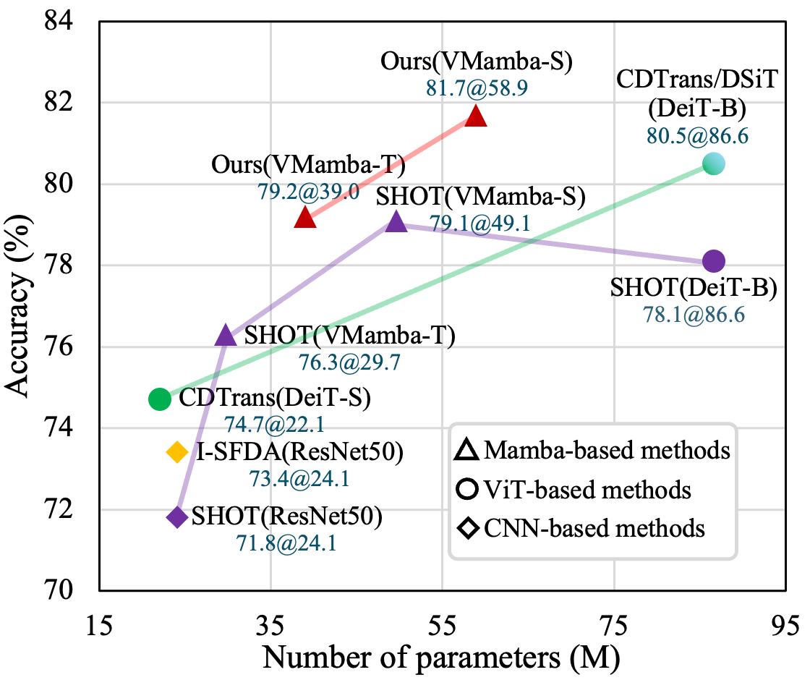

<div align="center">
<h1>SfMmaba </h1>
<h3>SfMamba: Efficient Source-Free Domain Adaptation via Selective Scan Modeling</h3>
<h3> Anonymous submission: ID 7706
</div>


## Overview

<p align="center">
  
</p>

* **SfMamba**
<p align="center">
  
</p>


## Main Results

### **Results**
| Name | Backbone | Office-Home | VisDA-C | Office | DomainNet-126| Params | FLOPs | Th. | 
| :---: | :---:| :---:| :---:| :---: |:---: | :---: | :---: | :---: | 
| SfMamba-S |VMamba-S[[`s2l15`]](https://github.com/MzeroMiko/VMamba/releases/download/%23v2cls/vssm_small_0229_ckpt_epoch_222.pth) | 81.7| 89.3| 93.3 | 77.9 | 58.9M | 9.2G | 503 | 
| SfMamba-T |VMamba-T[[`s1l8`]](https://github.com/MzeroMiko/VMamba/releases/download/%23v2cls/vssm1_tiny_0230s_ckpt_epoch_264.pth) | 79.2 | 88.5 | 91.2 | 76.2 | 39.0M | 5.4G | 701| 


## Getting Started

### Environment and Dataset Setup

- Follow [VMamba](https://github.com/MzeroMiko/VMamba) to create environment.
- Download the datasets Office, Office-Home, VisDA-C, DomainNet-126 from the official websites, and set 'data_root' in our training bash (run*.sh) to your dataroot.
- Download backbone checkpoints from link in the above table and put in folder utils/.


### Model Training
Both source and target model training commands are offered in each corresponding bash file.

```bash
bash run_sfda_office/officeHome/visda/domainnet126.sh 
```


