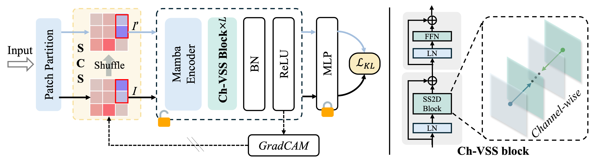

<div align="center">
<h1>SfMmaba </h1>
<h3>SfMamba: Efficient Source-Free Domain Adaptation via Selective Scan Modeling</h3>
</div>


## Overview

* **SfMamba**
<p align="center">
  
</p>


## Main Results

### **Results**
| Name | Backbone | Office-Home | VisDA-C | Office | DomainNet-126| Params | FLOPs | Th. | 
| :---: | :---:| :---:| :---:| :---: |:---: | :---: | :---: | :---: | 
| SfMamba-S |VMamba-S[[`s2l15`]](https://github.com/MzeroMiko/VMamba/releases/download/%23v2cls/vssm_small_0229_ckpt_epoch_222.pth) | 81.7| 89.3| 93.3 | 77.9 | 58.9M | 9.2G | 503 | 
| SfMamba-T |VMamba-T[[`s1l8`]](https://github.com/MzeroMiko/VMamba/releases/download/%23v2cls/vssm1_tiny_0230s_ckpt_epoch_264.pth) | 79.2 | 88.5 | 91.2 | 76.2 | 39.0M | 5.4G | 701| 


## Getting Started

### Environment and Dataset Setup
1. **Create Environment**  
Follow the [VMamba](https://github.com/MzeroMiko/VMamba) repository instructions to set up your Python environment.
2. **Download Datasets**  
Obtain the following datasets from their official sources: 
- Office
- Office-Home
- VisDA-C
- DomainNet-126 

  Set the `data_root` path in our training scripts (`run_sfda_*.sh`) to your dataset directory.

3. **Download Pretrained Backbones**  
- Get the checkpoint files from the links provided in the above table
- Place them in the `utils/` folder
- Configure `model_path` and `config` in the corresponding `run_sfda_*.sh` file

## Training Pipeline

We provide complete training scripts for both source model pre-training and target domain adaptation. The repository contains dedicated bash files for each benchmark dataset:

```bash
bash run_sfda_office.sh       # For Office dataset
bash run_sfda_officeHome.sh   # For Office-Home
bash run_sfda_visda.sh        # For VisDA-C
bash run_sfda_domainnet126.sh # For DomainNet-126
```
### 1. Source Model Training

**Example: Train source model on DomainNet126 Clipart domain (domain 0)**
```bash
python main_source.py 
    --cfg $config_file \
    --data_path ${data_root}/domainnet126/ \
    --lr $lr \
    --output $source_dir \
    --dataset domainnet126 \
    --test_envs 1 2 3 \
    --pretrained $model_path \
    --dg_aug \
    --batch_size 64 \
    --test_batch_size 32 \
    TRAIN.WARMUP_EPOCHS 3 \
    TRAIN.EPOCHS 30
```
--test_envs: Domains held out for testing

### 2. Target Model Training

**Example: Adapt from Clipart (domain 0) to Sketch (domain 3)**

```bash
st_cas="03"   # Source-Target pair (0→3)
for pair in $st_cas; do  
    s=${pair:0:1} # Source domain index
    t=${pair:1:1} # Target domain index
    echo "s=$s, t=$t"
    python main_target.py --cfg $config_file \
        --data_path ${data_root}/domainnet126/ \
        --lr $lr \
        --output $out_dir \
        --dataset domainnet126 \
        --target_env $t \
        --issave \
        --batch_size 32 \
        --source_env $s \
        --test_batch_size 16 \
        MODEL.SOURCE_DIR $source_dir \
        TRAIN.EPOCHS $epoch \
        TRAIN.WARMUP_EPOCHS 1 
done

```

## Inference
Examples for inference the model transfered from source domain 0 to target domain 1 in the Office-Home dataset with seed 1 is offered in below bash file.

```bash
bash inference.sh
```